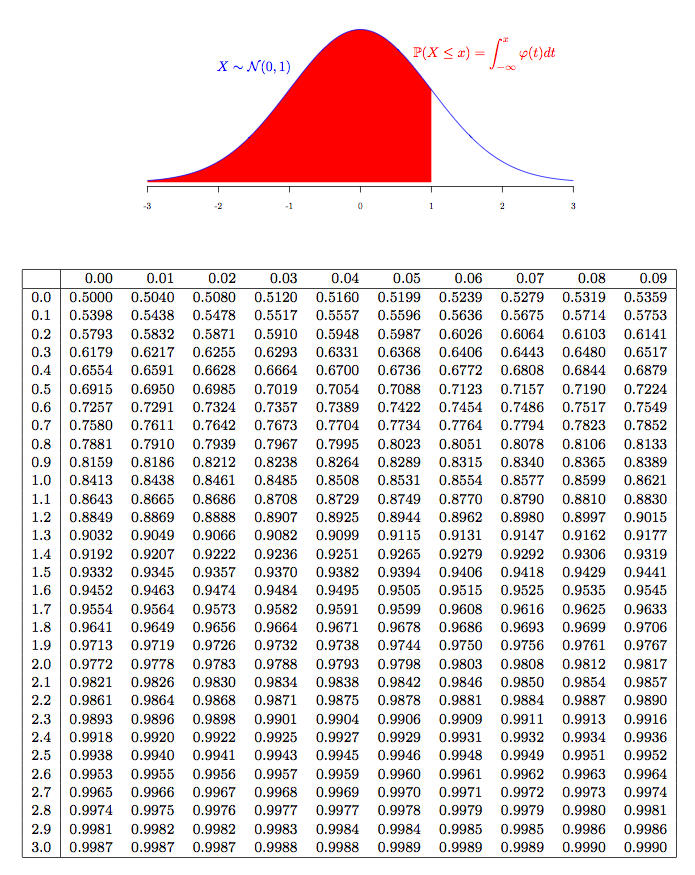

Normal law calculator
========================================================
author: Jonathan Helie
date: 2020-11-29
autosize: true

How about we get ride of the old normal law table?
========================================================

Those table are old and lame.



We can do it using this new shiny app!
========================================================

Easily available online on this website : https://johelie.shinyapps.io/NormalLawCalculator


How does it work?
========================================================

It take a input value of x.


```r
x <- 0.1
```

And calculate the cumulative normal distribution probability associated with this value.


```r
pnorm(x,0,1)
```

```
[1] 0.5398278
```

```r
1-pnorm(x,0,1)
```

```
[1] 0.4601722
```

New features coming soon!
========================================================

- Possibility of inputing mean and variance parameters.
- More advanced display feature (plot and stuff)
- A lot more!!!!!
